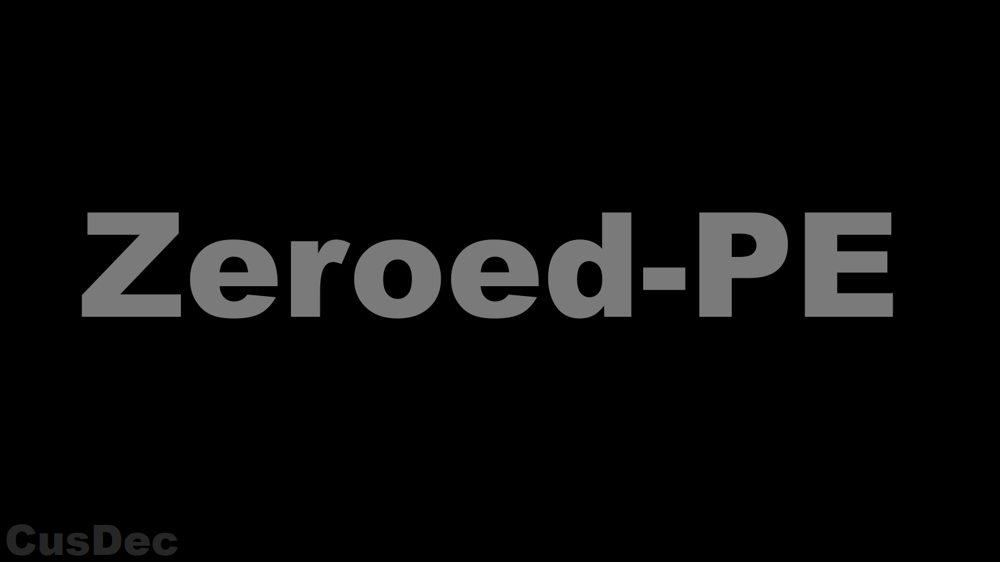

# Zeroed-PE
Windows PE (Portable Executable) file mutator.  
This is **not a protector or packer** — this is a low-level mutator for your **OWN PE files**.

Download here [Zeroed-PE](https://github.com/CusDec-dev/Zeroed-PE/releases/tag/Release) 

# Features

- 🧹 **PE Metadata Cleanup**
  - Remove DOS message artifacts
  - Remove Rich Header
  - Remove DanS signatures
  - Remove PDB paths
  - Remove Debug directory
  - Remove compiler and linker markers
  - Remove LLVM/LLD markers
  - Remove Rust-specific paths and markers
  - Remove PureBasic signatures
  - Remove Borland/Delphi/C++ TDS symbols
  - Remove PyInstaller strings
  - Remove AHTeam EP Protector signatures

- 🛠️ **Compiler Signature Cleanup**
  - MinGW
  - GCC
  - Clang
  - Microsoft Linker / Visual C++
  - FASM
  - TASM
  - Borland
  - IL2CPP
  - Delphi / Lazarus
  - FreePascal
  - Go
  - Legacy Visual Basic
  - Rust
  - TinyCC
  - PureBasic

- 🔧 **PE Header Mutation**
  - Blank section names
  - Normalize linker and subsystem versions
  - Zero `TimeDateStamp`
  - Zero PE checksum
  - Zero OS version information
  - Wipe Load Config when CFG is not enabled
  - Modify DOS Stub data
  - Apply debug flag mutations
  - Patch selected EntryPoint markers

- 📦 **Packer / Protector Signature Mutation**
  - Break ASPack detection signatures
  - Break UPX detection signatures
  - UPX EntryPoint mutation
  - Prevent standard `upx -d` unpacking
  - Break MPRESS signatures
  - MPRESS EntryPoint mutation
  - Break ASM-Guard signatures
  - Break Obfus.h signatures
  - Break ObfusHeader.h signatures
  - TinyCC EntryPoint patching for x86 PE files

- 📥 **Import Mutation**
  - Randomize import DLL casing
  - Import table mutation

- 🦀 **Rust Cleanup**
  - Remove `*.rs` source paths
  - Remove `/rustc/` paths
  - Remove `RustBacktraceMutex`
  - Remove Cargo / `std` markers

- ⚙️ **.NET**
  - Native PE metadata mutation
  - Note: .NET version modification was removed in `v1.0.1` because it could break .NET executables

- 📈 **Project**
  - `2500+` lines of code
  - Continuous PE mutation improvements
  - Designed for mutation of your **own PE files**

-  ⭐ **Please star this project**
